# DAX to SparkSQL UC Metric View Converter

An automated tool that converts DAX (Data Analysis Expressions) from Azure Analysis Services (AAS) to SparkSQL expressions compatible with Databricks Unity Catalog Metric Views.

## 🎯 Overview

This project uses LangChain with Databricks' Claude Sonnet 4 LLM to intelligently convert DAX measures from Azure Analysis Services into SparkSQL metric definitions for Unity Catalog. The converter processes metrics in batches and can handle conversions in parallel for improved performance.

## 🏗️ Architecture

```mermaid
flowchart TB
    AAS[("Azure Analysis Services<br/>(AAS)")]
    Metrics[("📄 metrics.json<br/>{name, expression}")]
    Prompt[("📋 Prompt<br/>Instructions + Examples<br/>DAX → SparkSQL")]
    Converter[("🔗 Converter<br/>(LangChain)")]
    LLM[("🤖 Databricks<br/>Model Serving Endpoint<br/>(Claude Sonnet 4)")]
    Output[("📝 UC Metrics<br/>(YAML/SparkSQL)")]
    
    AAS -->|"1. Extract Metrics<br/>(Manual)"| Metrics
    Metrics -->|"2. Reads DAX<br/>Metrics"| Converter
    Prompt -->|"3. Injects metrics<br/>to the prompt"| Converter
    Converter -->|"4. Provide prompt to<br/>Databricks Model"| LLM
    LLM -->|"5. Writes results as YAML<br/>containing SparkSQL expressions"| Output
    
    style AAS fill:#4A90E2
    style Metrics fill:#F5F5F5
    style Prompt fill:#4A90E2
    style Converter fill:#2C3E50
    style LLM fill:#E74C3C
    style Output fill:#F39C12
```



**Workflow:**
1. **Extract Metrics** - Manually export DAX measures from Azure Analysis Services
2. **Read Metrics** - Converter reads the `metrics.json` file containing DAX expressions
3. **Inject to Prompt** - Metrics are injected into a prompt with instructions and conversion examples
4. **LLM Processing** - Prompt is sent to Databricks Claude Sonnet 4 endpoint for conversion
5. **Generate Output** - Results are written as YAML files with SparkSQL UC Metric View definitions

## 📋 Prerequisites

- Python 3.12
- Pipenv
- Access to a Databricks workspace with Claude Sonnet 4 endpoint
- Valid Azure Analysis Services metrics exported as JSON
- Databricks access token

## 🚀 Installation

1. **Clone the repository** (if applicable):
   ```bash
   cd /path/to/aas_sparksql_converter
   ```

2. **Install dependencies using Pipenv**:
   ```bash
   pipenv install
   ```

3. **Activate the virtual environment**:
   ```bash
   pipenv shell
   ```

## ⚙️ Configuration

### 1. Environment Variables

Create a `.env` file in the project root with your Databricks credentials:

```bash
DATABRICKS_HOST=https://your-databricks-workspace.cloud.databricks.com
DATABRICKS_TOKEN=your-databricks-access-token
```

### 2. Metrics JSON File

**⚠️ IMPORTANT**: You must provide a valid `metrics.json` file extracted from Azure Analysis Services.

Place your metrics file at: `aas_metrics/metrics.json`

**Expected format**:
```json
{
  "measures": [
    {
      "name": "Metric Name",
      "expression": "DAX_EXPRESSION_HERE"
    },
    {
      "name": "Another Metric",
      "expression": "ANOTHER_DAX_EXPRESSION"
    }
  ]
}
```

**How to extract metrics from AAS:**
- Use tools like Tabular Editor, SSMS, or Azure Analysis Services REST API
- Export all measures/metrics with their DAX expressions
- Format them into the JSON structure shown above

### 3. Conversion Examples

**⚠️ IMPORTANT**: Enrich the LLM prompt by providing conversion examples in `knowledge_base/aas_sparksql_examples.py`.

The file contains a class with example DAX→SparkSQL conversions that guide the LLM. **Edit this file** to include examples relevant to your specific use case:

```python
class AASSparkSQLExamples:
    def __init__(self):
        self._content = """
        
        DAX expressions 
        
        [
          {
            "name": "Your Example Metric",
            "expression": "YOUR_DAX_EXPRESSION"
          }
        ]

        
        Unity Catalog Metric View Expressions (SparkSQL)
        
        - name: Your Example Metric
          # YOUR_DAX_EXPRESSION
          expr: YOUR_SPARKSQL_EXPRESSION
        """
```

**Tips for better conversions:**
- Include examples that cover common patterns in your metrics
- Add examples for complex calculations, time intelligence, and aggregations
- The more relevant examples you provide, the better the conversion quality

## 🏃 Running the Converter

### Basic Usage

Simply run the main script:

```bash
python dax_uc_metric_view_converter.py
```

### Configuration Options

Edit the configuration variables in the `__main__` section of `dax_uc_metric_view_converter.py`:

```python
BATCH_SIZE = 5        # Number of metrics to process per batch
MAX_WORKERS = 1       # Number of concurrent threads (for parallel processing)
```

**Performance tuning:**
- **BATCH_SIZE**: Larger batches = fewer API calls but longer processing time per batch
- **MAX_WORKERS**: More workers = faster processing but higher API usage (adjust based on your rate limits)

## 📤 Output

The converter generates several output files in the `uc_converted_metrics/` directory:

### Individual Batch Files
- `converted_metrics_YYYYMMDD_HHMMSS.txt` - One file per batch

### Combined Output
- `combined_all_metrics_YYYYMMDD_HHMMSS.txt` - All conversions merged into a single file

### Output Format

Each converted metric follows this format:

```yaml
- name: Metric Name
  # Original DAX expression as comment
  expr: SparkSQL expression
```

**Example:**
```yaml
- name: Average Price
  # DIVIDE([Total Revenue], [Total Quantity])
  expr: SUM(Revenue) / NULLIF(SUM(Quantity), 0)
```

## 🔄 Typical Workflow

1. **Extract metrics** from Azure Analysis Services
2. **Format them** into `aas_metrics/metrics.json`
3. **Add conversion examples** to `knowledge_base/aas_sparksql_examples.py`
4. **Configure** environment variables in `.env`
5. **Run** the converter: `python dax_uc_metric_view_converter.py`
6. **Review** output files in `uc_converted_metrics/`
7. **Apply** converted metrics to your Unity Catalog Metric Views
